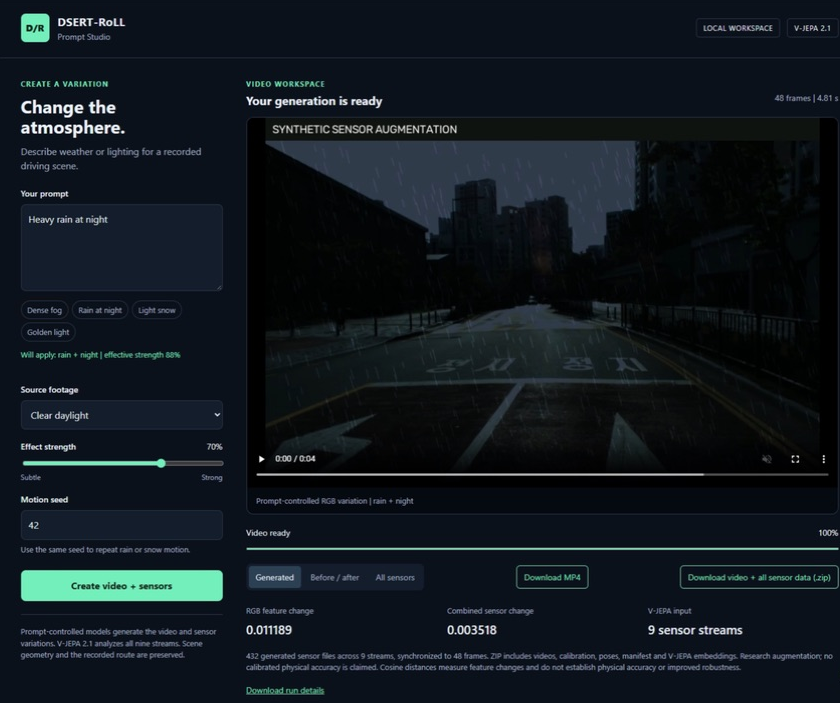
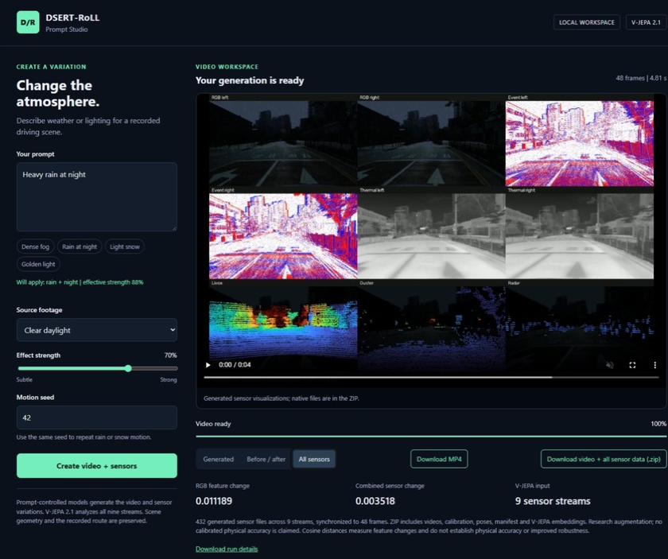

# DSERT-RoLL V-JEPA Studio

A local research interface for prompt-controlled weather and lighting variations of DSERT-RoLL recordings, with native synthetic sensor outputs and V-JEPA 2.1 analysis.

## What the prompt does

Choose a source recording, enter a supported weather or lighting prompt, set strength and seed, then generate. The app transforms the source video and all nine recorded sensor streams. V-JEPA 2.1 encodes source and generated visualizations to measure representation changes. V-JEPA is an encoder/predictor, not a text-to-video or raw-sensor decoder. Scene geometry, routes, object identities and recorded poses remain from the source dataset.

Supported effects: fog, rain, snow, night and warm light, including combinations such as **Heavy rain at night**. **Original** produces an unmodified reference condition. Unsupported object or route prompts are rejected.

## Quick start

Tested on Ubuntu 24.04 under WSL, Python 3.11, PyTorch 2.5.1 with CUDA 12.1, and one Quadro RTX 5000 GPU with 16 GB VRAM. The current model code requires CUDA. GPU indices are selectable; multiple GPUs are not combined.

1. Clone the public repository: `git clone https://github.com/kishordgupta/dsert-roll-vjepa-studio.git`, then `cd dsert-roll-vjepa-studio`. No GitHub sign-in is required to clone it.
2. Install Python 3.11 with venv support, Git and FFmpeg. On Ubuntu: `sudo apt-get install ffmpeg`.
3. Run `bash scripts/setup.sh`. This creates `.venv311`, installs dependencies, checks out the pinned V-JEPA source, applies the official-checkpoint URL patch, and downloads selected dataset subsets and the checkpoint. Allow several GB of disk and network traffic.
4. Run `CUDA_VISIBLE_DEVICES=0 bash prompt-studio/start.sh` (use `1` for the previously tested GPU on the remote workstation).
5. Open **http://127.0.0.1:8765** on the same computer.

The server binds to localhost and accepts one generation job at a time. Initial model loading takes longer than subsequent jobs. Logs are in `prompt-studio/server.log`.

## Demo

Choose **Clear daylight**, prompt **Heavy rain at night**, strength **0.7**, seed **42**. The word heavy scales effective strength to 0.875. The verified run produced 48 frames at approximately 9.987 fps, covering 4.806 seconds. Generation and analysis took 150.24 seconds on the tested GPU.

The demo produced **432 primary sensor files**, **88,286,126 events** and **3,828,874 points**. All 48 frames in all nine streams changed. The native sensor ZIP is about 586 MB and stays local. Small example videos and verification summaries are in [docs/demo](docs/demo).

## Finding generated data

Each run is under `prompt-studio/jobs/<job-id>/`:

| Output | Contents |
| --- | --- |
| `video.mp4` | Generated camera video |
| `comparison.mp4` | Source and generated comparison |
| `synthetic_sensors.mp4` | Preview of all generated streams |
| `sensor_data.zip` | Native sensor files, metadata and provenance |
| `sensor_data/` | Uncompressed native outputs |
| `embeddings.npz` | V-JEPA embeddings |
| `metrics.json` | Parameters, timing and representation distances |
| `validation.json` | Schema, timestamp and integrity validation |

Use the UI sensor ZIP download for native data. Preview videos are visualizations, not replacements for arrays.

## Sensor semantics

| Family | Streams | Native output and transformation |
| --- | --- | --- |
| RGB | Left, right | 960 x 600 PNG; lighting, haze, precipitation; scaled intrinsics |
| Events | Left, right | uint32 NPZ [x, y, polarity, source-local timestamp]; thinning and synthetic events |
| Thermal | Left, right | Non-radiometric PNG intensities; contrast and weather variation |
| LiDAR | Livox, Ouster | Structured NPY points; radial noise, dropout, attenuation, backscatter |
| Radar | One | Structured NPY points; range, power and Doppler perturbations |

Frame timestamps and recorded poses are retained. Event clock units are not independently calibrated. Thermal outputs are display intensities, not temperatures. Radar numeric units retain source conventions. These are sensor-specific research augmentations, not a physically calibrated shared-world simulator. No new GPS/IMU trajectories are synthesized.

## Model and data provenance

- [Meta V-JEPA 2/2.1](https://github.com/facebookresearch/vjepa2), commit `204698b45b3712590f06245fbfba32d3be539812`.
- Backbone: `vjepa2_1_vit_base_384`, distilled ViT-B; 16 sampled frames per stream and 768-dimensional embeddings.
- [DSERT-RoLL dataset](https://huggingface.co/datasets/jeongyh98/DSERT-RoLL), with revisions and sequence selections in `multisensor/selection.json` and `multisensor/synthetic-selection.json`.
- [Official dataset code](https://github.com/jeongyh98/DSERT-RoLL-Dataset).
- Model and dataset are subject to upstream licenses. Weights and recordings download separately. The selected public files use public URLs; no Hugging Face token is embedded.

## Code map

- `prompt-studio/catalog.py`: supported prompt grammar and recording catalog.
- `prompt-studio/sensor_synthesis.py`: native transformations and provenance.
- `prompt-studio/multisensor_pipeline.py`: synchronized generation and validation.
- `prompt-studio/engine.py`: rendering and V-JEPA feature extraction.
- `prompt-studio/server.py`, `static/`: localhost API and web interface.
- `multisensor/`: acquisition, schema handling, rendering and evaluation.
- `scripts/setup.sh`, `scripts/prepare_data.py`: portable installation.

## Validation and security

Run `.venv311/bin/python prompt-studio/test_sensor_models.py` for deterministic sensor checks. The verified full demo checked every primary file, source hashes, timestamps, full FFmpeg video decoding and ZIP CRC integrity. Representation distances measure feature changes, not physical realism or downstream accuracy.

Credentials, SSH keys, environment files, caches, weights, full datasets, jobs and logs are excluded from this repository. Store authentication outside the checkout. The temporary publishing deploy key is removed after upload verification.

After a completed run, verify the UI output bindings with `.venv311/bin/python prompt-studio/verify_sensor_app.py <job-id>`.

## Illustrated demo

[Five-page demo and setup guide](docs/DEMO_GUIDE.pdf) | [Screenshot gallery](docs/README.md)

