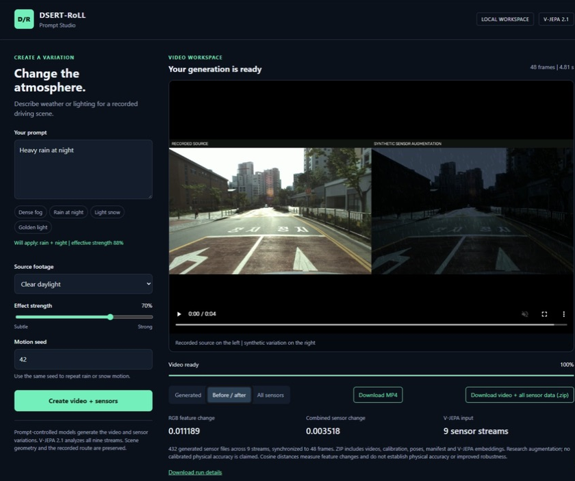

# Demo guide and live UI screenshots

**These images show prompt-controlled sensor augmentation with V-JEPA representation analysis.** The video and native sensor files are created by custom augmentation code applied to existing DSERT-RoLL recordings. V-JEPA 2.1 only extracts features from original and augmented visual sequences; project code compares those features.

The original goal of generating a new scene, video and corresponding sensor measurements through V-JEPA is **not implemented**. The predictor is discarded, the encoder is used without training or fine-tuning, and there is no learned video or sensor decoder. See [the component breakdown and limitations](../README.md#what-each-component-actually-does).

[Open the five-page demo PDF](DEMO_GUIDE.pdf). The screenshots and PDF retain the original UI terminology: **Generate**, **generated** and **synthetic** refer to procedurally augmented output files, not measurements generated by V-JEPA.

These screenshots were captured from the working studio on the remote computer on 2026-09-22. They show the verified **Heavy rain at night** experiment: source Clear daylight, strength 0.7, seed 42 (effective strength 0.875).

## Augmented video and prompt controls

The prompt selects predefined weather and lighting effects through a keyword parser. It is not passed to V-JEPA.

## Before and after

The scene, road, objects and trajectory come from the recorded source.

## All nine augmented sensor streams

Native arrays are available in the job archive. V-JEPA analyzes their rendered visual sequences separately; it does not synthesize the arrays.

The verified output comprises 48 frames (4.806 seconds), 432 primary sensor files, 88,286,126 events and 3,828,874 points after transformation. These totals include retained and perturbed source data along with any procedurally added samples. The full native sensor archive is approximately 586 MB and remains in the remote job directory.

The sensor transformations are research approximations, not a physically calibrated shared-world simulator. Recorded timestamps and poses are retained; no new GPS/IMU trajectory is synthesized. File-integrity checks and embedding distances do not demonstrate physical realism, cross-sensor consistency or downstream robustness.

The PDF covers operation, native formats, output locations, installation, validation, limitations and upstream sources. Model weights, full datasets and job archives are downloaded or produced separately.
